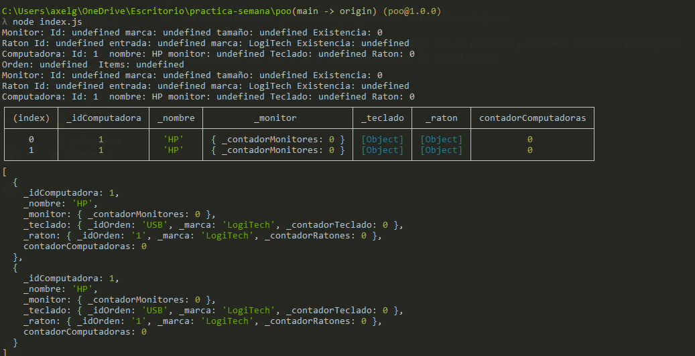

# practica-semana

## Se realizo una practica de programacion orientada a objetos.

se trabajo sobre un diagrama de clases brindado por el profesor y teniamos que hacer el programa 
el programa era sobre la creacion de ordenes de computadoras

